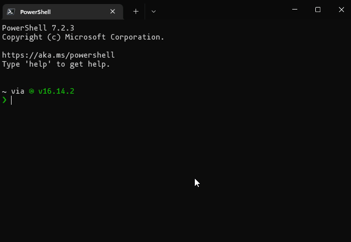

# PowerPoopizer

It is PoopMaker that anyone can install and use.


[](./LICENSE)




## Install

Copy and execute the following line on Powershell.
Poopizer will now be on your console as well.

```powershell
Install-Module -Name PowerPoopizer
```

Or Manual Download from [Here](https://www.powershellgallery.com/packages/PowerPoopizer)

## Usage

Generate poop from any string.

```powershell
Get-PoopsFromString -Src "Poop"
```

## Advanced usage

Override poop with a dollar bag.

```powershell
Get-PoopsFromString -Src "Poop" -OverridePoop "💰"
```

## LICENSE

The source code is licensed MIT. The website content is licensed CC BY 4.0, see [LICENSE](LICENSE).
